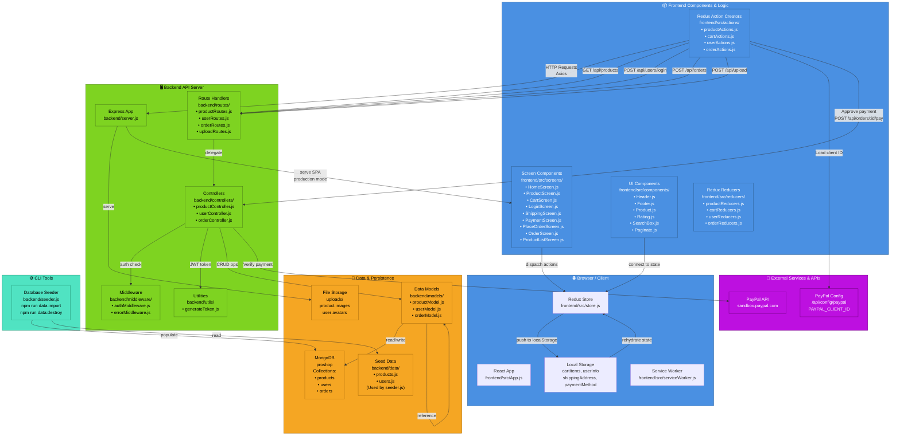
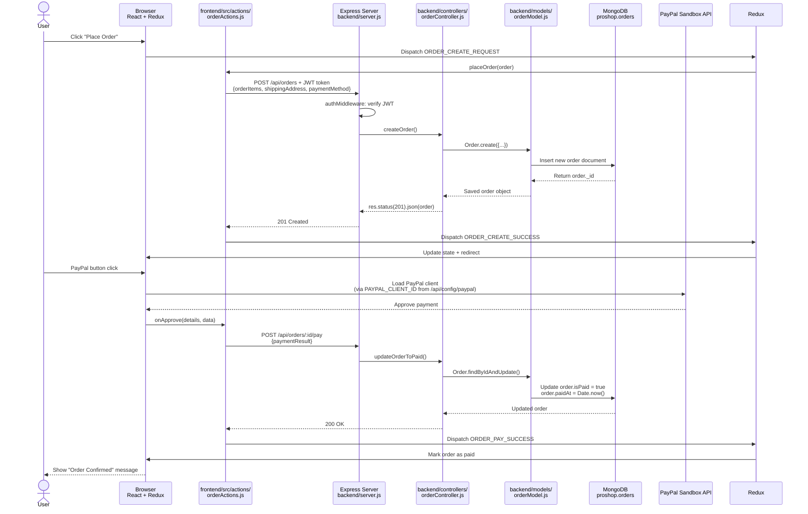

# ProShop MERN Architecture

## System Overview

ProShop is a full-stack eCommerce platform built with MongoDB, Express, React, and Node.js. This document describes the architectural design, component interaction, and data flow.

## C4 Container Diagram



## Data Flow: "Place Order" Use Case

The following sequence shows the complete data flow when a user places an order with PayPal payment:



## Entry Points

### Frontend Entry Points
- **`frontend/src/index.js`** — React app initialization, Provider wraps Redux store
- **`frontend/src/App.js`** — Main router, defines all screen routes
- **Screen Components** — Entry points for user interactions (`HomeScreen`, `LoginScreen`, etc.)
- **Action Creators** (`frontend/src/actions/*`) — Initiate HTTP requests via Redux Thunk

### Backend Entry Points
- **`backend/server.js`** — Express app, middleware registration, route mounting
- **Routes** (`backend/routes/*`) — HTTP endpoints (e.g., `POST /api/orders`)
- **Controllers** (`backend/controllers/*`) — Business logic handlers
- **CLI Commands** — `backend/seeder.js` (data import/destroy via npm scripts)

### External Entry Points
- **PayPal Sandbox API** — Called from frontend via `react-paypal-button-v2` library
- **Multer File Upload** — `backend/routes/uploadRoutes.js` saves to `uploads/` directory

## Data Stores

### MongoDB Collections
- **`products`** — Product catalog with prices, reviews, stock
- **`users`** — User accounts with hashed passwords, roles (admin/customer)
- **`orders`** — Order records with items, shipping address, payment status

### Browser Local Storage
- **`cartItems`** — Array of products in cart
- **`userInfo`** — Logged-in user data + JWT token
- **`shippingAddress`** — Delivery address
- **`paymentMethod`** — Payment method selection (Credit Card / PayPal)

### File System Storage
- **`uploads/`** — Product images and user avatars (ephemeral on cloud platforms)

## External Services & APIs

### PayPal
- **Endpoint**: `sandbox.paypal.com` (development) / `paypal.com` (production)
- **Client ID**: Configured via `PAYPAL_CLIENT_ID` environment variable
- **Config endpoint**: `GET /api/config/paypal` — frontend fetches client ID before rendering PayPal button
- **Payment approval**: Frontend calls PayPal SDK → user approves → sends payment details to `POST /api/orders/:id/pay`

## Technology Stack

### Frontend
- **React 16+** — UI library, component-based architecture
- **Redux** — Centralized state management with Redux Thunk for async actions
- **React Router v5** — Client-side routing between screens
- **Axios** — HTTP client for API calls
- **React Bootstrap** — UI components
- **react-paypal-button-v2** — PayPal payment integration

### Backend
- **Express.js** — HTTP server framework
- **Mongoose** — MongoDB object modeling
- **bcryptjs** — Password hashing
- **jsonwebtoken** — JWT token generation and verification
- **Multer** — File upload handling
- **express-async-handler** — Async route error wrapping
- **morgan** — HTTP request logging (development)
- **dotenv** — Environment variable management

### Database
- **MongoDB 4+** — NoSQL document database
- **Mongoose 5** — Schema validation and relationships

### DevOps & Environment
- **Node.js 14.6+** — ES Modules support
- **npm** — Package management
- **Heroku** — Primary deployment target (with `heroku-postbuild`)
- **Docker** — Optional MongoDB containerization

## Authentication & Authorization Flow

```
User → LoginScreen (frontend/src/screens/LoginScreen.js)
  ↓
dispatch userLoginAction (frontend/src/actions/userActions.js)
  ↓
POST /api/users/login (backend/routes/userRoutes.js)
  ↓
userController.authUser() (backend/controllers/userController.js)
  ↓
generateToken (backend/utils/generateToken.js)
  ↓
Response includes JWT token
  ↓
Frontend stores token in localStorage.userInfo
  ↓
Protected routes require authMiddleware (backend/middleware/authMiddleware.js)
  ↓
authMiddleware extracts JWT from Authorization: Bearer <token> header
  ↓
Verified user attached to req.user
  ↓
Controller can access req.user for authorization checks
```

Auto-logout occurs when backend returns error: `'Not authorized, token failed'` (matched by frontend catch handlers in all action creators).

## File Organization

```
proshop_mern/
├── frontend/
│   ├── src/
│   │   ├── index.js                     # React entry point
│   │   ├── App.js                       # Main router
│   │   ├── store.js                     # Redux store configuration
│   │   ├── actions/                     # Redux action creators (Thunks)
│   │   ├── reducers/                    # Redux reducers
│   │   ├── screens/                     # Full-page components
│   │   ├── components/                  # Reusable UI components
│   │   ├── constants/                   # Redux action type strings
│   │   └── serviceWorker.js             # PWA service worker
│   └── package.json                     # Frontend dependencies
│
├── backend/
│   ├── server.js                        # Express app entry point
│   ├── seeder.js                        # CLI: Database initialization
│   ├── config/
│   │   └── db.js                        # MongoDB connection
│   ├── routes/                          # HTTP endpoint definitions
│   ├── controllers/                     # Request handlers
│   ├── models/                          # Mongoose schemas
│   ├── middleware/                      # Auth & error handling
│   ├── utils/                           # Helper functions
│   ├── data/                            # Sample seed data
│   └── CLAUDE.md                        # Backend architecture guide
│
├── uploads/                             # Product images & avatars
├── docs/                                # Project documentation
├── .env                                 # Environment variables (local dev)
├── .env.example                         # Environment variables template
├── CLAUDE.md                            # Main project guide
└── package.json                         # Root dependencies & scripts
```

## Deployment Architecture

### Development
```
npm run dev
├── Frontend: React dev server (:3000) — Webpack, hot reload, proxy to backend
└── Backend: Node.js (:5001) — nodemon, Morgan logging
```

### Production
```
node backend/server.js (PORT injected by platform)
├── Frontend: Static build (frontend/build/) served by Express
└── Backend: Minified Node.js app
```

## Known Limitations & Gotchas

1. **File Storage is Ephemeral** — `uploads/` exists only on the running instance. On cloud platforms with auto-scaling or container restart, uploaded files are lost. Replace with S3, Cloudinary, or similar.

2. **No CORS Middleware** — CRA dev proxy handles cross-origin during development; production relies on same-origin. If frontend and backend are on separate domains, add `cors` package.

3. **Port 5000 Reserved** — macOS Control Center holds port 5000. Backend uses 5001. Mismatch between `.env` PORT and frontend `package.json` proxy causes silent `ECONNREFUSED`.

4. **JWT Token in localStorage** — XSS-vulnerable. Consider moving to secure, httpOnly cookies in production.

5. **Mongoose Version Lock** — Cannot upgrade past v5 without removing `useCreateIndex: true` config.

## Performance Considerations

- **No API caching** — Every screen reload fetches fresh data from backend
- **No pagination lazy-loading** — Product list loads entire page at once
- **No image optimization** — Uploaded images served as-is, no CDN or resizing
- **No code splitting** — Entire React app bundled into single JS file (requires webpack refactor)
- **Redux DevTools in prod** — `composeWithDevTools` left enabled, adds memory overhead

## Security Considerations

- JWT tokens stored in localStorage (XSS-readable)
- No CSRF protection tokens
- No rate limiting on endpoints
- Passwords hashed with bcryptjs (secure)
- Admin routes depend on `admin` middleware after `protect` (correct order enforced)
- File uploads not validated for type/size
