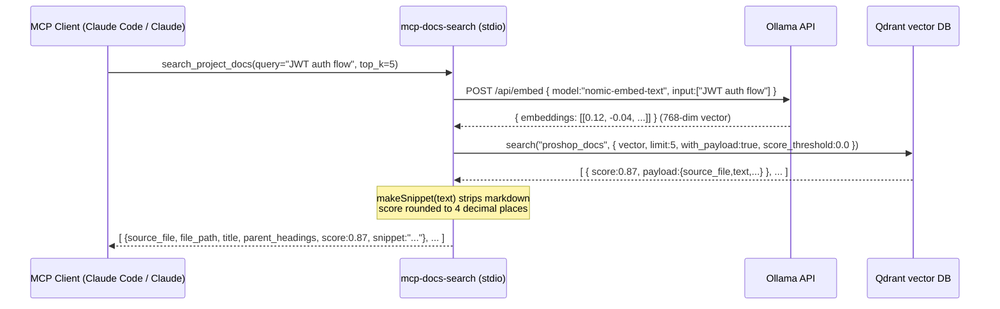
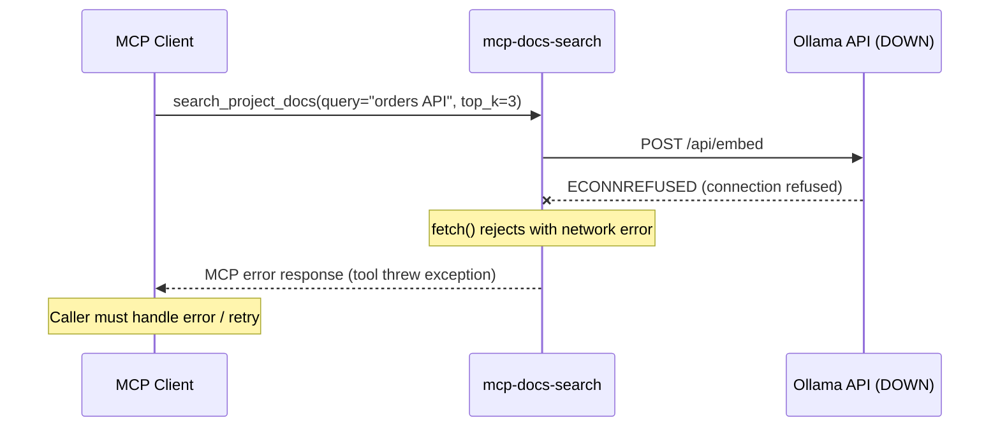

# Module Spec: mcp-docs-search

**Source files:** `mcp-docs-search/src/search.ts`, `mcp-docs-search/src/server.ts`
**Produced by:** legacy-auditor-mate (Stage 3 living documentation)
**Last updated:** 2026-05-29

---

## 1. Overview

The `mcp-docs-search` module is a Model Context Protocol (MCP) server that exposes a single `search_project_docs` tool. It provides semantic (vector) search over the ProShop project's documentation corpus.

**Pipeline:**
1. Accept a natural-language `query` string and optional `top_k` integer from the MCP client
2. Convert the query to a dense embedding vector via **Ollama** (`/api/embed`)
3. Run approximate nearest-neighbour search in **Qdrant** against the pre-indexed `proshop_docs` collection
4. Map raw Qdrant hits to `Chunk` objects (source metadata + plain-text snippet)
5. Return ranked chunks to the MCP client

**Infrastructure dependencies:**
| Service | Default URL | Purpose |
|---|---|---|
| Ollama | `http://localhost:11434` | Text embedding (model: `nomic-embed-text`) |
| Qdrant | `http://localhost:6333` | Vector database for similarity search |

**Environment variables (all optional, with defaults):**

| Variable | Default | Purpose |
|---|---|---|
| `OLLAMA_URL` | `http://localhost:11434` | Ollama API base URL |
| `OLLAMA_MODEL` | `nomic-embed-text` | Embedding model name |
| `QDRANT_URL` | `http://localhost:6333` | Qdrant API base URL |
| `QDRANT_COLLECTION` | `proshop_docs` | Qdrant collection to search |

**Output per chunk:**
| Field | Type | Description |
|---|---|---|
| `source_file` | string | Filename of the source document |
| `file_path` | string | Relative path to the source document |
| `title` | string | Title of the section/chunk |
| `parent_headings` | string[] | Ancestor heading hierarchy |
| `score` | number | Cosine similarity (0.0–1.0, rounded to 4 decimal places) |
| `snippet` | string | ~200-char plain-text excerpt, markdown stripped |

**No authentication** — runs as a trusted stdio MCP process; network exposure is the responsibility of the process launcher.

---

## 2. Decision Table

### `searchDocs(query, topK)` — behaviour under different conditions

| Condition | Result |
|---|---|
| Ollama reachable, model loaded, Qdrant reachable | Returns array of ≤ `topK` `Chunk` objects ordered by descending score |
| Ollama returns non-200 status | `embed()` throws `Error("Ollama embed failed <status>: <body>")` — propagates to MCP error response |
| Ollama unreachable (ECONNREFUSED) | `fetch` rejects — propagates as unhandled rejection to MCP layer |
| Qdrant collection not found | `qdrant.search()` throws — propagates to MCP error response |
| Qdrant collection exists but no documents indexed | Returns empty array `[]` |
| `topK = 0` | Qdrant `limit: 0` — returns empty array (Qdrant accepts limit 0) |
| Query is empty string `""` | Ollama embeds empty string → valid but low-quality vector → results may be noise |
| Chunk payload missing `text` field | `makeSnippet("")` → empty string `""` for snippet; other fields default to `""` or `[]` |
| Chunk payload `text` is all markdown (code blocks, tables) | `makeSnippet` strips all content → may produce empty or near-empty snippet |
| `score_threshold` | Hard-coded to `0.0` — all hits returned regardless of relevance; caller decides cutoff |

### `makeSnippet(text, maxLen)` — text processing decisions

| Input characteristic | Behaviour |
|---|---|
| Text shorter than `maxLen` (200) | Returned as-is (after markdown stripping) |
| Text longer than `maxLen` | Cut at last word boundary before 200 chars, append `…` |
| Word boundary too early (< 70% of maxLen) | Hard cut at exactly `maxLen` chars + `…` |
| Fenced code blocks ` ```...``` ` | Removed entirely |
| Inline code `` `...` `` | Removed entirely |
| Markdown tables `|...|` | Lines removed |
| `##` headings | `#` prefix removed; heading text preserved |
| Bold `**text**` | Markers removed; text preserved |
| Italic `*text*` | Markers removed; text preserved |
| Links `[text](url)` | Only anchor text preserved; URL removed |
| List markers `- ` / `* ` / `> ` | Removed; list content preserved |

---

## 3. Sequence Diagram

### Happy path: MCP client queries for documentation



### Error path: Ollama unavailable



---

## 4. Edge Cases

1. **Ollama not running** — `fetch()` to `/api/embed` throws `ECONNREFUSED`; the error is not caught inside `searchDocs` — propagates as an unhandled promise rejection, surfaced as an MCP tool error to the client. The server process stays alive.
2. **Ollama model not pulled** (`nomic-embed-text` not downloaded) — Ollama returns a 4xx response body with error message; `embed()` throws `"Ollama embed failed 404: ..."`. Client receives a structured MCP error.
3. **Qdrant collection `proshop_docs` does not exist** (not yet indexed) — `qdrant.search()` throws a 404-style error; propagates as MCP tool error. No graceful empty-array fallback.
4. **`top_k` very large (e.g., 10,000)** — passed directly to Qdrant `limit`. Qdrant enforces its own server-side max (default 10,000). Latency and payload size may be extreme; no client-side cap in the module.
5. **`top_k` is 0** — Qdrant accepts `limit: 0` and returns an empty array. `searchDocs` returns `[]`. This is technically valid but useless; the MCP server should validate `top_k >= 1`.
6. **Query contains only special characters** (e.g., `"???!!!"`) — embedded into a valid vector by Ollama; results are low-quality but no crash.
7. **Query is very long** (e.g., a full paragraph, 2,000 chars) — Ollama may truncate at its model's token limit (512 for `nomic-embed-text`). No warning is emitted; results may be based on a truncated representation of the query.
8. **Qdrant hit missing the `text` payload field** — `(p.text as string) ?? ""` defaults to empty string; `makeSnippet("")` returns `""`. The chunk is included in results with an empty snippet — no crash, but the caller receives a misleading zero-content result.
9. **Qdrant hit with `text` that is only fenced code blocks** — all content stripped by `makeSnippet`; snippet is `""`. Same issue as above.
10. **`score_threshold = 0.0` (hardcoded)** — all indexed documents are returned sorted by score, including completely irrelevant ones with score near 0. The caller (Claude) is responsible for interpreting scores; there is no server-side relevance gate.
11. **`makeSnippet` word-boundary cut produces empty result** — if the stripped text has its only word at position > 200 chars, `lastIndexOf(" ", 200)` returns -1 (or a very small negative), causing hard cut at `maxLen`. Result is always non-null but may end mid-word.
12. **Multiple simultaneous requests** — `qdrant` client is a module-level singleton; concurrent `search()` calls share the same client instance. Qdrant client is stateless per-request so this is safe, but event loop can be saturated with many parallel embed+search requests.
13. **`QDRANT_COLLECTION` env var set to a non-existent collection name** — Qdrant returns an error for the unknown collection; `qdrant.search()` throws. No fallback to the default collection.
14. **Ollama returns `embeddings` array with zero elements** — `data.embeddings[0]` is `undefined`; passed as `vector: undefined` to `qdrant.search()`. Qdrant will return an error for an invalid vector; error propagates as MCP tool failure.

---

## 5. Open Questions

1. **No `score_threshold` parameter exposed to the caller** — should `search_project_docs` accept an optional `min_score` parameter so callers can filter low-quality results without post-processing?
2. **No retry logic for transient Ollama/Qdrant failures** — a single network blip causes the entire search to fail. Should an exponential-backoff retry (1–3 attempts) be added for `fetch` calls?
3. **`top_k` is not validated** — callers can pass 0 or extremely large values. Should the server enforce `1 ≤ top_k ≤ 20` (or similar) and return a validation error?
4. **`makeSnippet` strips code blocks entirely** — for a code-heavy docs corpus, this loses the most useful content. Should code snippets be preserved up to a character limit?
5. **No indexing tool exposed** — the MCP server only searches; indexing requires running a separate `update_project_index.py` script manually. Should indexing be triggered via an MCP tool or a file-watcher?

---

## 6. Suggested Tests

| # | Scenario | Expected |
|---|---|---|
| T1 | `embed()` — Ollama returns 200 with valid embeddings | Returns `number[]` of correct dimension |
| T2 | `embed()` — Ollama returns 500 | Throws `"Ollama embed failed 500: ..."` |
| T3 | `makeSnippet("")` | Returns `""` |
| T4 | `makeSnippet("text under 200 chars")` | Returns text unchanged |
| T5 | `makeSnippet` with fenced code block | Code block removed; surrounding prose preserved |
| T6 | `makeSnippet` with text > 200 chars, space at char 180 | Cut at char 180, append `…` |
| T7 | `makeSnippet` with no spaces in first 200 chars | Hard cut at 200, append `…` |
| T8 | `searchDocs` — Qdrant returns 3 hits | Returns array of 3 `Chunk` objects with correct fields |
| T9 | `searchDocs` — Qdrant returns hit with missing `text` payload | Chunk has `snippet: ""`, no crash |
| T10 | `searchDocs` — `topK = 0` | Returns `[]` |
| T11 | `score` field rounded to 4 decimal places | Raw `0.87654321` → `0.8765` |
| T12 | `searchDocs` — Ollama unreachable (mock `fetch` to reject) | Throws network error (not swallowed) |
