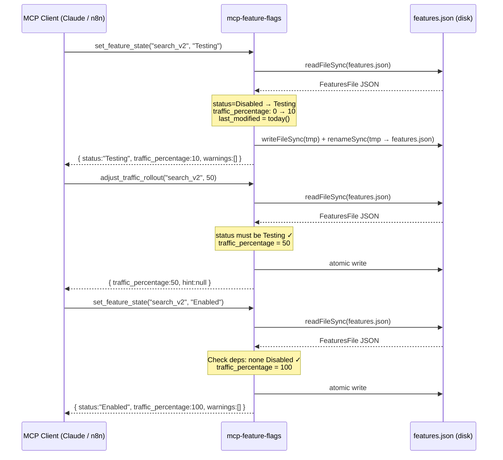
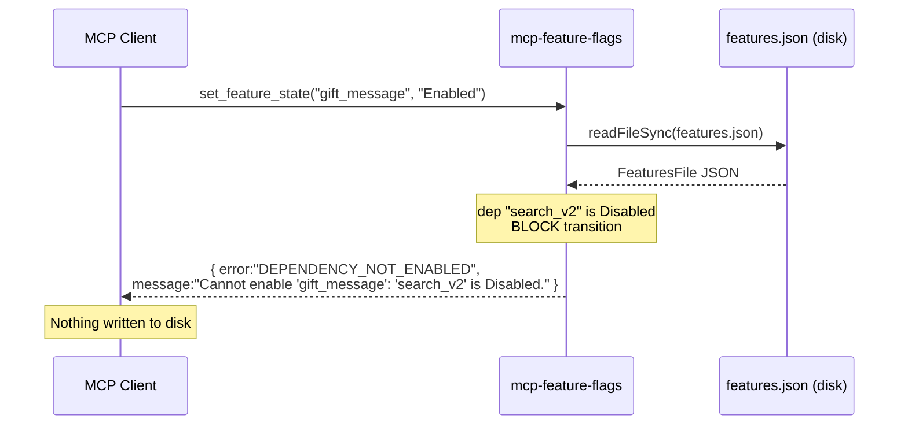

# Module Spec: mcp-feature-flags

**Source files:** `mcp-feature-flags/src/helpers.ts`, `mcp-feature-flags/src/server.ts`, `mcp-feature-flags/src/server-http.ts`
**Produced by:** legacy-auditor-mate (Stage 3 living documentation)
**Last updated:** 2026-05-29

---

## 1. Overview

The `mcp-feature-flags` module is a Model Context Protocol (MCP) server that exposes four tools for managing feature flags stored in `features.json` at the project root.

**Responsibilities:**
- Read and write feature flag state from/to `features.json` (JSON file on disk)
- Enforce lifecycle state machine: `Disabled → Testing → Enabled` (and reverse)
- Block unsafe transitions (e.g., enabling a feature when a dependency is `Disabled`)
- Emit non-blocking warnings when dependencies are only `Testing`
- Adjust `traffic_percentage` for features in `Testing` state

**Two transport variants:**
| Transport | File | Auth |
|---|---|---|
| stdio (default) | `server.ts` | None (trusted local process) |
| HTTP Streamable | `server-http.ts` | Bearer token via `MCP_API_KEY` env var |

**State file:** `features.json` — a JSON object keyed by `feature_id`. Each record contains: `name`, `description`, `status`, `traffic_percentage`, `last_modified`, `targeted_segments`, `rollout_strategy`, `dependencies`.

**Tools exposed:**
| Tool | Description |
|---|---|
| `list_features` | Summary of all feature flags |
| `get_feature_info` | Full state of one feature including dependency statuses |
| `set_feature_state` | Change status with side-effect logic |
| `adjust_traffic_rollout` | Fine-tune traffic % for Testing features |

---

## 2. Decision Table

### `setFeatureState` — state transition rules

| Requested state | Dependency condition | Action | Side effects |
|---|---|---|---|
| `Disabled` | Any | ALLOW | `traffic_percentage = 0` |
| `Testing` | All deps `Enabled` | ALLOW | `traffic_percentage` preserved if 1–99, else reset to 10 |
| `Testing` | Any dep not `Enabled` | ALLOW + WARN | Same; warning appended to response |
| `Enabled` | Any dep `Disabled` | **BLOCK** — `DEPENDENCY_NOT_ENABLED` error | Nothing written |
| `Enabled` | Any dep `Testing` (but none `Disabled`) | ALLOW + WARN | `traffic_percentage = 100` |
| `Enabled` | All deps `Enabled` or no deps | ALLOW | `traffic_percentage = 100` |
| Any | Invalid state string | BLOCK — `INVALID_STATE` error | Nothing written |
| Any | `feature_id` not in file | BLOCK — `FEATURE_NOT_FOUND` error | Nothing written |
| Any | `features.json` unreadable | BLOCK — `FILE_READ_ERROR` error | Nothing written |
| Any | Disk write fails | BLOCK — `FILE_WRITE_ERROR` error | State not persisted |

### `adjustTrafficRollout` — guard rules

| Condition | Result |
|---|---|
| Feature not in `Testing` | BLOCK — `WRONG_STATUS_FOR_ROLLOUT` |
| `percentage` not integer or out of 0–100 | BLOCK — `INVALID_PERCENTAGE` |
| `percentage = 0` after write | ALLOW + hint: suggest `set_feature_state → Disabled` |
| `percentage = 100` after write | ALLOW + hint: suggest `set_feature_state → Enabled` |
| 1 ≤ `percentage` ≤ 99 | ALLOW, no hint |

---

## 3. Sequence Diagram

### Happy path: promote feature from Disabled to Enabled (with Testing intermediary)

### Blocked path: enable feature with disabled dependency

---

## 4. Edge Cases

1. **`features.json` missing on disk** — `readFeatures()` catches `ENOENT` and throws `{ code: "FILE_READ_ERROR" }`. No features are accessible until the file is restored.
2. **`features.json` is malformed JSON** — `JSON.parse()` throws; caught and re-thrown as `{ code: "JSON_PARSE_ERROR" }`. The file is not modified.
3. **Atomic write fails mid-rename** (disk full, permissions) — temp file `.features-<ts>.tmp` is created but rename fails; cleanup via `unlinkSync(tmp)` is attempted. Original `features.json` remains unchanged.
4. **Feature has `dependencies` array with an ID that does not exist in `features.json`** — `features[dep]` is `undefined`; `getFeatureInfo` returns `dependency_states[dep] = undefined` (field is present but empty). `setFeatureState` treats a missing dep as neither `Disabled` nor `Testing` — the `disabledDeps` filter skips it (undefined is not `"Disabled"`), so the transition is allowed without blocking.
5. **`traffic_percentage` is already 0 when transitioning to `Testing`** — reset logic triggers (`0 < 1`), sets `traffic_percentage = 10`. Previous 0 value from a prior `Disabled` state is overwritten.
6. **`traffic_percentage` is already 100 when transitioning to `Testing`** — reset logic triggers (`100 > 99`), sets `traffic_percentage = 10`. Caller must use `adjustTrafficRollout` to get back to 100.
7. **`set_feature_state` called with correct state but different casing** (e.g., `"enabled"`, `"TESTING"`) — `VALID_STATES` check is exact (case-sensitive); returns `INVALID_STATE` error immediately without reading the file.
8. **Concurrent writes (two callers simultaneously)** — no file-level lock exists. Race condition: both read the same file, both write their own tmp file, one rename overwrites the other. Last-write-wins; one update is silently lost.
9. **`adjust_traffic_rollout` called with `percentage = 0`** — transition is ALLOWED (not blocked), `traffic_percentage` is set to 0, but status remains `Testing`. The hint message guides the caller to call `set_feature_state → Disabled` instead.
10. **`adjust_traffic_rollout` called with `percentage = 100`** — same as above: status stays `Testing`, `traffic_percentage = 100`, hint suggests promoting to `Enabled`. This is intentional so the caller can do a final sanity check before promoting.
11. **Feature with no `dependencies` field at all** — `feat.dependencies ?? []` defaults to empty array; all dependency loops are skipped; no warnings emitted; `Enabled` transition is always allowed.
12. **HTTP transport (`server-http.ts`) missing `MCP_API_KEY` env var** — `process.exit(1)` at startup (fail-fast). The server never binds to a port. Fixed in Stage 2 (was previously a hardcoded fallback key).
13. **`FEATURES_JSON_PATH` env var set to a directory** — `readFileSync` on a directory throws `EISDIR`; caught as `FILE_READ_ERROR`.

---

## 5. Open Questions

1. **No file lock for concurrent access** — should a file-level advisory lock (`proper-lockfile` or `fs.openSync` with `O_EXCL`) be added? Current atomic rename only prevents partial writes, not lost updates.
2. **Missing dep in `dependencies` array is silently ignored** — should the system return an error or warning when a declared dependency does not exist in `features.json`?
3. **`traffic_percentage = 0` in Testing state** — is this a valid long-term state (feature paused in testing) or should it auto-transition to `Disabled`? Currently it only emits a hint.
4. **No audit log** — state changes are written directly to `features.json` with only `last_modified` date. Should a separate append-only audit log (JSON Lines) be maintained for compliance/rollback?
5. **No schema validation on load** — `readFeatures()` parses any valid JSON as `FeaturesFile` without validating that required fields (`status`, `traffic_percentage`, `last_modified`) are present and correct types.

---

## 6. Suggested Tests

| # | Scenario | Expected |
|---|---|---|
| T1 | `setFeatureState("X", "Enabled")` when dep Y is `Disabled` | `DEPENDENCY_NOT_ENABLED` error; file unchanged |
| T2 | `setFeatureState("X", "Testing")` when current `traffic_percentage = 0` | `traffic_percentage` reset to 10 |
| T3 | `setFeatureState("X", "Testing")` when current `traffic_percentage = 50` | `traffic_percentage` preserved at 50 |
| T4 | `setFeatureState("X", "Disabled")` | `traffic_percentage = 0`; `status = Disabled` |
| T5 | `setFeatureState("X", "enabled")` (wrong case) | `INVALID_STATE` error |
| T6 | `adjustTrafficRollout("X", 50)` when status is `Enabled` | `WRONG_STATUS_FOR_ROLLOUT` error |
| T7 | `adjustTrafficRollout("X", 0)` when status is `Testing` | `traffic_percentage = 0`; hint present |
| T8 | `adjustTrafficRollout("X", 101)` | `INVALID_PERCENTAGE` error |
| T9 | `getFeatureInfo("nonexistent")` | `FEATURE_NOT_FOUND` error |
| T10 | `features.json` deleted before any call | `FILE_READ_ERROR` error |
| T11 | `setFeatureState` on feature with dep that doesn't exist in file | Transition succeeds; no crash |
| T12 | `writeFeatures` called — verify atomic write (tmp file then rename) | Temp file named `.features-<ts>.tmp`; final file identical |
